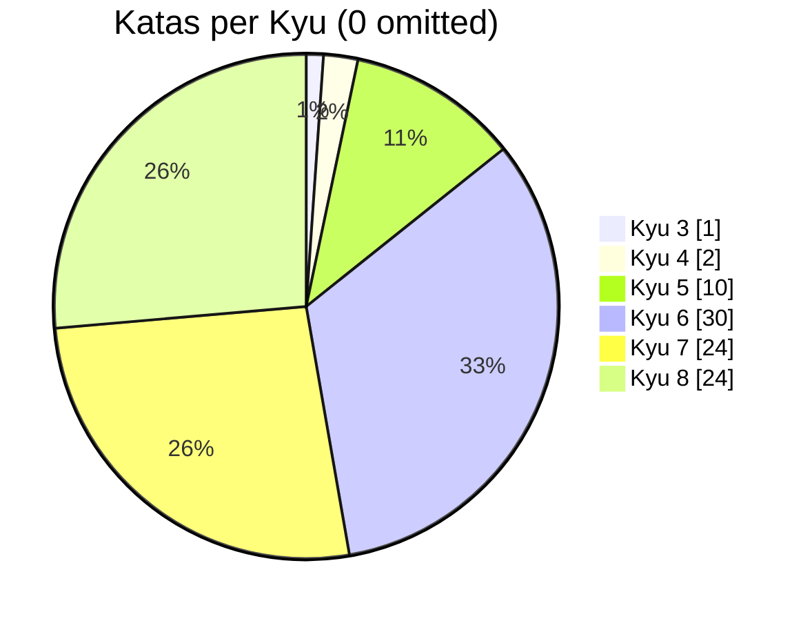

# Codewars

[](https://github.com/MauricioLudwig/codewars/actions/workflows/ci.yml)
[](https://github.com/MauricioLudwig/codewars/actions/workflows/linter.yml)
[](https://github.com/prettier/prettier)


| Kyu | Katas |
| :-: | :-: |
|1|0|
|2|0|
|3|1|
|4|2|
|5|10|
|6|30|
|7|24|
|8|24|
|All|91|



This is my monorepo housing my solutions for the katas presented at [Codewars](https://www.codewars.com/). Below follows a succinct summary of the motivation for said repository as well as the goal aspired in solving these problems.

## Getting Started

Scripts

```
npm run test
npm run test:watch
npm run update:readme
npm run lint
```

Github Actions

```
CI
Lint Code Base
Update README
```

Useful extensions (whilst using Visual Studio Code)
* [Jest Snippets](https://marketplace.visualstudio.com/items?itemName=andys8.jest-snippets)
* [Jest Test Explorer](https://marketplace.visualstudio.com/items?itemName=kavod-io.vscode-jest-test-adapter)
* [Prettier - Code formatter](https://marketplace.visualstudio.com/items?itemName=esbenp.prettier-vscode)

## Motivation

### TDD

Although not required in the submission of solutions, I make it an effort (or rather a requirement on my own behalf) to write a test file for each kata, wherein the test file itself is always written ahead of the functionality of said solution. This in order to adhere to the principles of test-driven development. Also it allows me to practice and test out the different assertions offered by the given testing library.

Additionally, the test files provide a cohesive code coverage which is then evaluated in the pipeline set up for this project whenever a new commit is merged to the repository.

### Practice & Elevation

Not only do I get to practice (and repeat quite frequently) long established coding practices in TypeScript/JavaScript but the Katas allow, in certain instances, for me to learn something new, for instance the many utility types offered in TypeScript (some which may otherwise find little leverage in production applications).

### Learn new languages

My predisposition towards TypeScript has thus far not yielded much in favor of new languages although this is something I wish to explore at some point in the future.